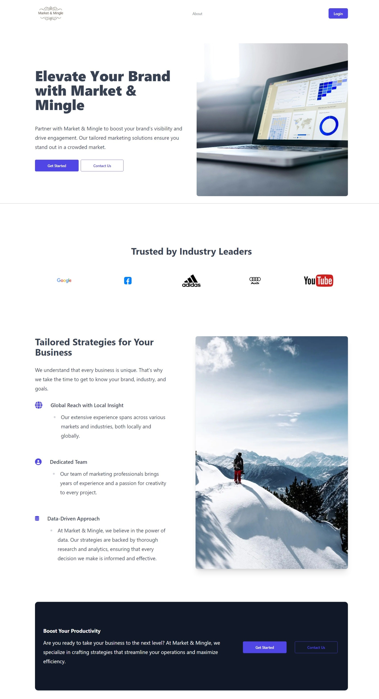

<a name="readme-top"></a>

<!-- PROJECT SHIELDS -->
<!--
*** I'm using markdown "reference style" links for readability.
*** Reference links are enclosed in brackets [ ] instead of parentheses ( ).
*** See the bottom of this document for the declaration of the reference variables
*** for contributors-url, forks-url, etc. This is an optional, concise syntax you may use.
*** https://www.markdownguide.org/basic-syntax/#reference-style-links
-->

[![Contributors][contributors-shield]][contributors-url]
[![Forks][forks-shield]][forks-url]
[![Stargazers][stars-shield]][stars-url]
[![Issues][issues-shield]][issues-url]
[![MIT License][license-shield]][license-url]
[![LinkedIn][twitter-shield]][twitter-url]
[![LinkedIn][linkedin-shield]][linkedin-url]

<!-- PROJECT LOGO -->
<br />
<div align="center">
  <!-- <a href="https://github.com/OpenOceanHQ/payloadcms-website-template">
    
  </a> -->

<h3 align="center">Payload CMS website template</h3>

  <p align="center">
    A website builder template built with Payloadcms 3.0
    <br />
    <a href="https://github.com/OpenOceanHQ/payloadcms-website-template"><strong>Explore the docs »</strong></a>
    <br />
    <br />
    <a href="https://github.com/OpenOceanHQ/payloadcms-website-template">View Demo</a>
    ·
    <a href="https://github.com/OpenOceanHQ/payloadcms-website-template/issues/new?labels=bug&template=bug-report---.md">Report Bug</a>
    ·
    <a href="https://github.com/OpenOceanHQ/payloadcms-website-template/issues/new?labels=enhancement&template=feature-request---.md">Request Feature</a>
  </p>
</div>

<!-- TABLE OF CONTENTS -->
<details>
  <summary>Table of Contents</summary>
  <ol>
    <li>
      <a href="#about-the-project">About The Project</a>
      <ul>
        <li><a href="#built-with">Built With</a></li>
      </ul>
    </li>
    <li>
      <a href="#getting-started">Getting Started</a>
      <ul>
        <li><a href="#prerequisites">Prerequisites</a></li>
        <li><a href="#installation">Installation</a></li>
        <li><a href="#docker">Docker</a></li>
        <li><a href="#production">Production</a></li>
        <li><a href="#deployment">Deployment</a></li>
      </ul>
    </li>
    <li><a href="#usage">Usage</a></li>
    <li><a href="#structure">Structure</a></li>
    <li><a href="#contributing">Contributing</a></li>
    <li><a href="#license">License</a></li>
    <li><a href="#contact">Contact</a></li>
  </ol>
</details>

<!-- ABOUT THE PROJECT -->

## About The Project

Build your website with ease using our website builder template. Our block-based system makes making your website as easy as dragging and dropping a couple of blocks!

<br />


<p align="right">(<a href="#readme-top">back to top</a>)</p>

### Built With

- [![Next][Next.js]][Next-url]
- [![React][React.js]][React-url]
- [![Tailwindcss][Tailwindcss]][tailwindcss-url]
- [![Payload][payload-cms]][payload-url]

<p align="right">(<a href="#readme-top">back to top</a>)</p>

<!-- GETTING STARTED -->

## Getting Started

To get a local copy of our template up and running follow these simple steps.

### Prerequisites

- npm
  ```sh
  npm install npm@latest -g
  ```
- setup environment variables in your project's root directory
  ```sh
  DATABASE_URI=<your-database-url>
  PAYLOAD_SECRET=<your-payload-secret>
  ```

### Installation

To spin up the project locally, follow these steps:

1. First clone the repo
2. Then `cd YOUR_PROJECT_REPO`
3. Next `yarn && yarn dev` (or `docker-compose up`, see [Docker](#docker))
4. Now `open http://localhost:3000/admin` to access the admin panel
5. Create your first admin user using the form on the page

That's it! Changes made in `./src` will be reflected in your app.

<p align="right">(<a href="#readme-top">back to top</a>)</p>

### Docker

Alternatively, you can use [Docker](https://www.docker.com) to spin up this project locally. To do so, follow these steps:

1. Follow [steps 1 and 2 from above](#development), the docker-compose file will automatically use the `.env` file in your project root
2. Next run `docker-compose up`
3. Follow [steps 4 and 5 from above](#development) to login and create your first admin user

That's it! The Docker instance will help you get up and running quickly while also standardizing the development environment across your teams.

## Production

To run Payload in production, you need to build and serve the Admin panel. To do so, follow these steps:

1. First invoke the `payload build` script by running `yarn build` or `npm run build` in your project root. This creates a `./build` directory with a production-ready admin bundle.
2. Then run `yarn serve` or `npm run serve` to run Node in production and serve Payload from the `./build` directory.

### Deployment

The easiest way to deploy your project is to use [Payload Cloud](https://payloadcms.com/new/import), a one-click hosting solution to deploy production-ready instances of your Payload apps directly from your GitHub repo. You can also deploy your app manually, check out the [deployment documentation](https://payloadcms.com/docs/production/deployment) for full details.

<!-- USAGE EXAMPLES -->

## Usage

Manage your backend with the admin dashboard

![Admin Dashboard Screen Shot][admin-dashboard-screenshot]

Build pages from your dashboard with layout and blocks from the pages collection.
<br />

<div style="display: flex">


</div>

<br />
Build your page with our pre-built blocks or create your own!

<br />


<br />

We leverage the powerful Form builder plugin to give you the best form creation and submission experience!

<br />

Simply create your form and add it as a block in your page. Form submissions will be sent straight to your dashboard!

<div style="display: flex">


</div>
<br />

What your forms will look like

<div>

</div>

<!-- _For more examples, please refer to the [Documentation](https://example.com)_ -->

<p align="right">(<a href="#readme-top">back to top</a>)</p>

<!-- FILE STRUCTURE -->

## Structure

<!-- file structure with collections, globals and brief explanation -->

This is the typical file structure of the project.

```plaintext
  src
  ├── access
  ├── app
  │   ├── (app)
  │   ├── (payload)
  │   │   ├── admin
  │   │   ├── api
  │   │   ├── Blocks
  │   │   └── fields
  │   ├── globals
  │   └── my-route
  ├── collections
  │   ├── Media
  │   ├── Pages
  │   └── Users
  ├── common
  │   ├── Blocks
  │   └── Components
  ├── utilities
  │── payload-types.ts
  └── payload.config.ts
```

payload.config.ts is the configuration file for the payload application. You can control the configuration for the entire application from here.

Whenever you create a collection or globals schema, you have to add it to the config file and generate types for it using the command:

```bash
yarn generate:types
```

This will generate payload-types.ts file in your root directory.

- The app directory inside your /src folder contains all the backend files for payload collections, globals and your api end points.
- Collections and Globals are schemas that are defined which will be converted into a database collection of your choice.
- You can configure things like access control, fields shown in admin panel, custom hooks and so on from your collection configuration file.
- Globals are similar to collections, but they contain app-wide data that your site or app might rely on like header and footer settings.

**Collections:**

- Users - This collection will be automatically generated when you setup the application. First time login will automatically make you an **admin** user.
- Media - This collection lets you upload photos that you can use anywhere in your application.
- Pages - The pages collection will let you add and manage your pages. You can build your page with blocks that are pre-built by us or you can make your own blocks!

<p align="right">(<a href="#readme-top">back to top</a>)</p>

<!-- CONTRIBUTING -->

## Contributing

Contributions are what make the open source community such an amazing place to learn, inspire, and create. Any contributions you make are **greatly appreciated**.

See the [open issues](https://github.com/OpenOceanHQ/payloadcms-website-template/issues) for a full list of proposed features (and known issues).

If you have a suggestion that would make this better, please fork the repo and create a pull request. You can also simply open an issue with the tag "enhancement".
Don't forget to give the project a star! Thanks again!

1. Fork the Project
2. Create your Feature Branch (`git checkout -b feature/AmazingFeature`)
3. Commit your Changes (`git commit -m 'Add some AmazingFeature'`)
4. Push to the Branch (`git push origin feature/AmazingFeature`)
5. Open a Pull Request

<p align="right">(<a href="#readme-top">back to top</a>)</p>

<!-- LICENSE -->

## License

Distributed under the MIT License. See `LICENSE.txt` for more information.

<p align="right">(<a href="#readme-top">back to top</a>)</p>

<!-- CONTACT -->

## Contact

Open Ocean Technologies - [@cornerrrhq](https://x.com/cornerrrhq) - info@openoceantechnologies.in

Project Link: [https://github.com/OpenOceanHQ/payloadcms-website-template](https://github.com/OpenOceanHQ/payloadcms-website-template)

<p align="right">(<a href="#readme-top">back to top</a>)</p>

<!-- MARKDOWN LINKS & IMAGES -->
<!-- https://www.markdownguide.org/basic-syntax/#reference-style-links -->

[contributors-shield]: https://img.shields.io/github/contributors/OpenOceanHQ/payloadcms-website-template.svg?style=for-the-badge
[contributors-url]: https://github.com/OpenOceanHQ/payloadcms-website-template/graphs/contributors
[forks-shield]: https://img.shields.io/github/forks/OpenOceanHQ/payloadcms-website-template.svg?style=for-the-badge
[forks-url]: https://github.com/OpenOceanHQ/payloadcms-website-template/network/members
[stars-shield]: https://img.shields.io/github/stars/OpenOceanHQ/payloadcms-website-template.svg?style=for-the-badge
[stars-url]: https://github.com/OpenOceanHQ/payloadcms-website-template/stargazers
[issues-shield]: https://img.shields.io/github/issues/OpenOceanHQ/payloadcms-website-template.svg?style=for-the-badge
[issues-url]: https://github.com/OpenOceanHQ/payloadcms-website-template/issues
[license-shield]: https://img.shields.io/github/license/OpenOceanHQ/payloadcms-website-template.svg?style=for-the-badge
[license-url]: https://github.com/OpenOceanHQ/payloadcms-website-template/blob/master/LICENSE.txt
[linkedin-shield]: https://img.shields.io/badge/-LinkedIn-black.svg?style=for-the-badge&logo=linkedin&colorB=555
[linkedin-url]: https://www.linkedin.com/company/cornerrr
[twitter-shield]: https://img.shields.io/badge/X-000000?style=for-the-badge&logo=x&logoColor=white
[twitter-url]: https://x.com/cornerrrhq
[product-screenshot]: public/images/screenshot.png
[admin-dashboard-screenshot]: public/images/admin-dashboard.png
[Next.js]: https://img.shields.io/badge/next.js-000000?style=for-the-badge&logo=nextdotjs&logoColor=white
[Next-url]: https://nextjs.org/
[payload-url]: https://payloadcms.com/
[payload-cms]: public/images/payload.svg
[React.js]: https://img.shields.io/badge/React-20232A?style=for-the-badge&logo=react&logoColor=61DAFB
[React-url]: https://reactjs.org/
[tailwindcss]: https://img.shields.io/badge/Tailwind_CSS-38B2AC?style=for-the-badge&logo=tailwind-css&logoColor=white
[tailwindcss-url]: https://tailwindcss.com/
